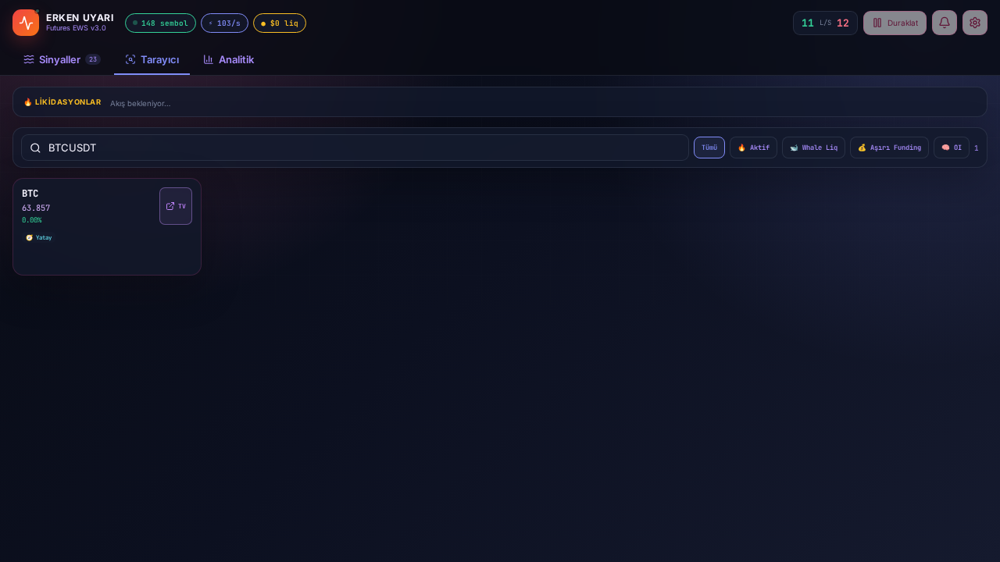

# EWS v3 — Futures Erken Uyarı

Eski tek dosyalık EWS v2.1 uygulamasının **React 19 + Vite + TypeScript** ile yeniden yazılmış, modüler ve test edilmiş sürümü.



## Hızlı başlangıç

```bash
npm install
npm run dev
```

Production paketi:

```bash
npm run build
npm run preview
```

Tam doğrulama:

```bash
npm run verify       # typecheck + 59 unit/component testi + build + 2 Chromium E2E
npm run test:live    # canlı Binance REST/WS veri kontrolü
npm run test:coverage
```

## Korunan özellikler

- Gerçek zamanlı Binance USD-M Futures akışı
- Mini ticker, mark price/funding, bütün book ticker'lar ve likidasyonlar
- Likidasyon sonrası dinamik `aggTrade` takibi
- Adaptif whale eşiği
- Long/short, strateji ailesi ve tier filtreleri
- Sinyal TTL, neden zinciri, perception barları ve işlem planı
- Bayes çarpanı, quarter-Kelly boyutlandırma ve R:R modeli
- Scanner: hot, whale, funding ve OI filtreleri
- Pattern hafızası, otomatik doğrulama ve horizon istatistikleri
- Analitik, doğrulama ve sinyal geçmişi
- Toast, ses, TTS, titreşim ve dış bağlantılar
- Candy, dark ve sistem temasını izleyen auto tema
- Mobil alt navigasyon
- Ayar/hafıza JSON import-export ve v2 localStorage migrasyonu

## Strateji motoru

| Aile | Üretilen sinyaller | Ana veriler |
|---|---|---|
| Whale | `WHALE_FLUSH_REVERSAL` LONG/SHORT | Adaptif whale liquidation, bite, CVD, OBI, toxic flow |
| Cascade | `CASCADE_CONTINUATION` LONG/SHORT | 10 sn liquidation kaskadı, fiyat ve hacim |
| Absorption | `ABSORPTION_SETUP` | Liq cluster/trap, ters OBI, agresif akış |
| Breakout | `BREAKOUT_CONFIRMED` LONG/SHORT | Önceki 4 sn range, buffer, volume surge |
| Momentum | `MOMENTUM_SURGE` LONG/SHORT | 5 sn fiyat hareketi ve hacim patlaması |
| Flow | `FLOW_REVERSAL_LONG/SHORT` | Rolling aggTrade, flow flip, CVD |
| Funding | `FUND_SQUEEZE_LONG/SHORT` | Ayarlanabilir funding eşiği ve mean reversion |
| OI | `OI_CONFIRM_LONG/SHORT`, `OI_SQUEEZE` | Ardışık OI snapshot ve snapshot fiyatı |

Tek bir uç değer artık tek başına S-tier üretemez. Skor, bağımsız kanıt sayısı ve kategori çeşitliliğine göre sınırlandırılır.

## 2026 veri mimarisi

Binance'ın 23 Nisan 2026 sonrası URL ayrımı kullanılıyor:

- Market combined: `wss://fstream.binance.com/market/stream?streams=...`
- Public book ticker: `wss://fstream.binance.com/public/stream?streams=!bookTicker`
- Dinamik aggTrade: `wss://fstream.binance.com/market/ws`
- REST: `https://fapi.binance.com`

REST erişimi bölgesel olarak HTTP 451 dönerse uygulama çökmüyor; sembolleri canlı miniTicker akışından keşfedip WS modunda çalışmaya devam ediyor. OI, REST yeniden erişilebilir olana kadar devre dışı kalır.

### CoinGlass

Güncel `liquidationOrders` akışı API anahtarı ister. Varsayılan olarak kapalıdır.

```bash
cp .env.example .env.local
# .env.local içine:
VITE_COINGLASS_API_KEY=...
```

> Vite ortam değişkenleri tarayıcı paketinde görünür. Üretimde CoinGlass anahtarını istemciye gömmek yerine backend WebSocket proxy kullanın.

## Düzeltilen kritik v2 sorunları

- `detect()` içinde tanımlanmadan kullanılan `whaleUsd` yüzünden oluşan çalışma zamanı hatası giderildi.
- Hatalı `/market/ws?streams=` ve `/public/ws?streams=` URL biçimleri düzeltildi.
- 2026'da kapanan legacy `wss://fstream.binance.com/ws` aggTrade bağlantısı kaldırıldı.
- Eski/anahtarsız CoinGlass endpoint'i güvenli ve opsiyonel adaptöre çevrildi.
- Range breakout hesabının mevcut fiyatı kendi range'ine katıp sahte kırılım üretmesi düzeltildi.
- Bite/CVD akışı lifetime toplam yerine rolling pencerelere taşındı.
- Likidasyon sayısı ve hacmi duvar saatiyle sıfırlanmak yerine gerçek rolling 1 saat olarak hesaplanıyor.
- Binance + CoinGlass aynı olaylarının çift sayılması engellendi.
- OI yönü son 1 saniyelik tick yerine OI snapshot fiyatına bağlandı.
- UI'daki funding ve doğrulama ayarları gerçekten motora bağlandı.
- Bekleyen doğrulamalara fiyat yoksa retry/expiry eklendi.
- Pattern ve sinyal geçmişi kalıcı hale getirildi.
- `innerHTML` tabanlı arayüz kaldırıldı; React güvenli metin render'ı kullanılıyor.
- React render yükü 200 ms throttle edilmiş external engine snapshot'larıyla ayrıldı.

## Proje yapısı

```text
src/
  components/       React arayüzü
  data/             Binance/CoinGlass gateway, parser ve reconnect
  engine/           Market state, perception, strategy, learning
  hooks/            useSyncExternalStore bağlantısı
  lib/              Storage, format, link, bildirim, i18n
  types/            Merkezi TypeScript tipleri
tests/
  *.test.*          Unit, engine ve component testleri
  e2e/              Chromium masaüstü/mobil testleri
  integration/      Canlı REST/WebSocket şema testi
legacy/index.html    Orijinal v2.1 kaynak
```

## Test durumu — 3 Ağustos 2026

- TypeScript strict typecheck: **PASS**
- Unit/component/engine/parser: **59/59 PASS**
- Chromium E2E: **2/2 PASS**
- Production build: **PASS** — yaklaşık 92 kB gzip JS
- Canlı `/market` combined WS: **PASS**
- Canlı `/public` bookTicker WS: **PASS**
- Canlı dinamik aggTrade WS: **PASS**
- Binance REST: test ortamının bölgesel uygunluk politikası nedeniyle **SKIP — HTTP 451**
- CoinGlass canlı bağlantı: API anahtarı verilmediği için **SKIP**; iki şema parser'ı unit test edildi

Ayrıntı: [`docs/VERIFICATION.md`](docs/VERIFICATION.md)

## Sınırlar

Bu uygulama emir göndermez ve API trade anahtarı istemez. Üretilen skorlar olasılık tahmini niteliğindedir; kâr garantisi değildir. Production kullanımında uzun süreli veri saklama, merkezi backtest ve gizli anahtarlar için ayrı bir backend gerekir.
